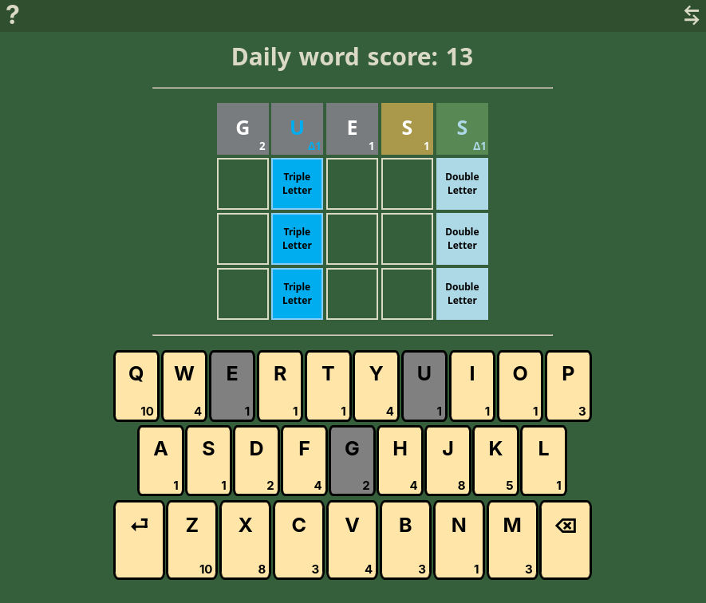
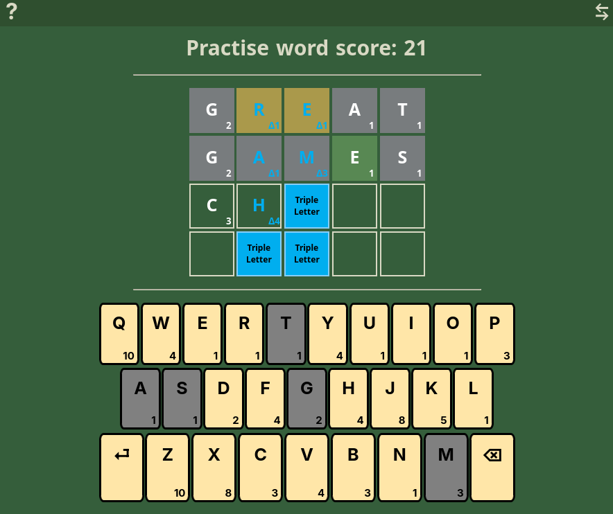

# WORDLE + SCRABBLE = ?
Numdle - A Wordle-inspired minigame with a little touch of Scrabble.

Game Link: https://ed1-ble.github.io/Numdle/

## FEATURES ⭐

- Features daily word rotation (although technically the word rotates every 6 hours)
- Word validation against word list with 10k+ words!
- Bonus squares acting as clues! Sum up the words to see if they match the hinted score!
- Mobile compatible UI and a custom keypad/keyboard thingy!

- Practise mode for, well, practising.
- Press ⇆ to switch to practise mode! 
- BTW, Press '?' for a little guide!

## TECH STACK 🛠

- **Frontend:** HTML, CSS, Vanilla JavaScript 
- **Backend:** Express.js 
- **Deployment:** Vercel 

**Remarks:**

This app no longer uses the custom API deployed on Vercel, and now uses a local fetch script to get daily word, but the API still works!

Repo to my custom Wordle API: https://github.com/ed1-ble/WordleAPI

## CREDITS: 
- Common 5L Word List : https://gist.github.com/shmookey/b28e342e1b1756c4700f42f17102c2ff
- wordle-list : https://github.com/tabatkins/wordle-list/blob/main/words

## LICENSE
This project is licensed under the [MIT License](LICENSE) - see the [LICENSE](LICENSE) file for details.
